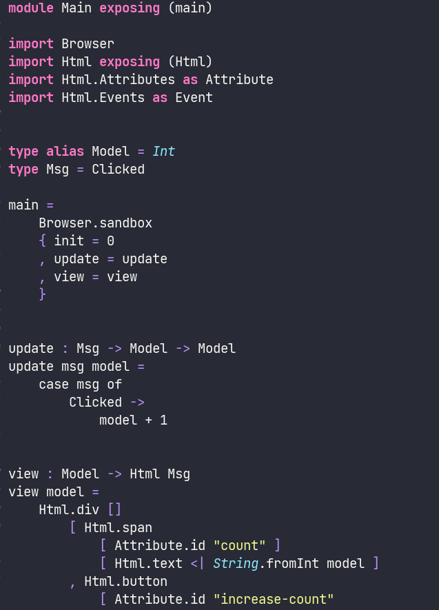

# Unofficial Emacs Gren Lang Package!

Simple highlighting & tooling support for the [Gren programming language](https://gren-lang.org/)

> Comes with `gren-format` to quickly format your code using the `gren format` command!

---

## TODO's

- [ ] Implement gren-format failure in properly displayed buffer
- [ ] Create a [Tree Sitter](https://tree-sitter.github.io/tree-sitter/) parser
- [ ] Remove current font-lock based highlighting
- [ ] Add steps for adding Gren's Tree Sitter parser to Emacs
- [ ] Add more utility functions
