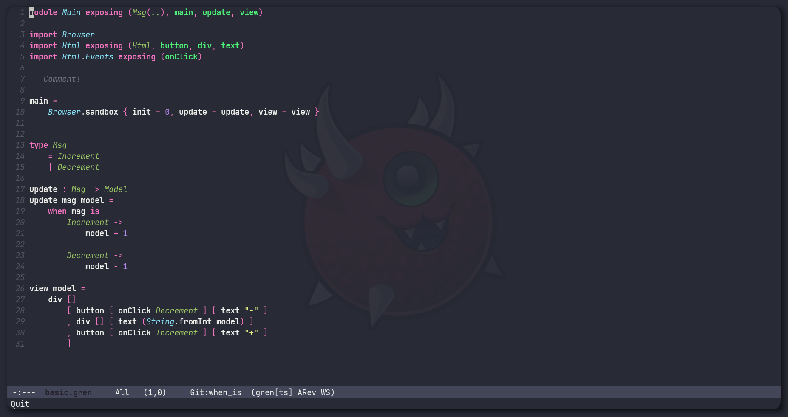

# Unofficial Emacs Gren Lang Package!

Simple highlighting & tooling support for the [Gren programming language](https://gren-lang.org/) implemented in the Native Treesit package

> Comes with `M-x gren-format` to quickly format your code using the `gren format` command!



---

# Setting Up

Simply add the gren-mode.el package and run `M-x gren-ts-mode`

This will automatically add the gren tree sitter parser to `treesit-language-source-alist` so that you can install the parser with:
```
M-x treesit-install-language-grammar gren
```

After which, simply open up a gren file and get to coding!

## Notes

- Current the gren formatter is a bit broken, if you run the gren format command and you get an error or nothing happens, it is because its ran into a parsing error.

- The formatting used here is based on the tree-sitter grammar, and probably will not always indent code in a way the gren parser likes, if this happens, please file an issue


## TODOS

- [ ] [Add to melpa](https://github.com/melpa/melpa/blob/master/README.md)